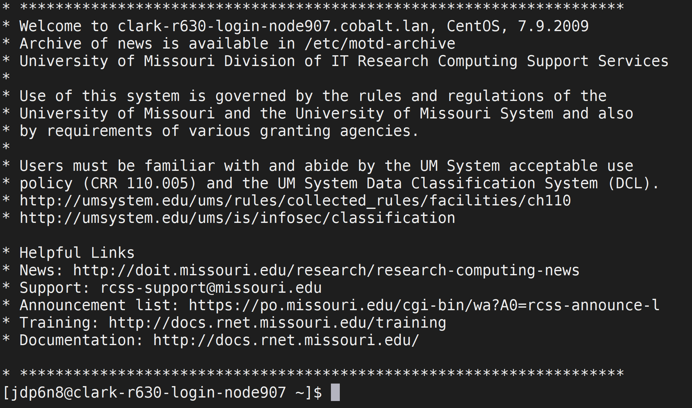

```{r setup, include=FALSE}
knitr::opts_chunk$set(echo = TRUE)
knitr::opts_chunk$set(eval=FALSE)
```

## Section 1: Connecting to Clark with mobaXterm
1. Visit <https://missouri.app.box.com/v/rcss-mobaxterm-new> and download both files into your downloads folder.
2. Run the .exe file, accept all defaults for installation.
3. Open mobaXterm and click "Start Local Terminal" This will open a command interface for you to connect to Clark with.
4. Generate a ssh key:
    i) In your terminal type `ssh-keygen`.
    ii) Accept all defaults by pushing enter. Do not enter a password.
    iii) You only need to do this once!
5. Connect to Clark
    i) In your terminal, type `ssh <username>@clark.rnet.missouri.edu`  
    Replace `<username>` with your pawprint.  
    
    ii) Do not include brackets, for example `ssh jdp6n8@clark.rnet.missouri.edu`
    iii) When prompted for your password, enter your university password. **NOTE THAT WHAT YOU TYPE DOES NOT SHOW UP IN THE TERMINAL** You should then see something like this:  
    
  
## Section 2: Linux commands on Clark
# Need to add data copy
Watch [**this video**](https://youtu.be/9vZ8V6KDYFo) if you are not familiar with bash/linux commands. These will be useful in mobaXterm and Clark.  
**Question 2.1** In your own words, provide a description of what each of the following bash terminal commands do (google is your friend):  
- `pwd`  
- `ls`  
- `cd`  
- `touch`  
- `rm`  
- `cat`  
- `cp`  
- `mv`  
- `mkdir`  
&nbsp;

**Question 2.2** In your home directory, create a folder named `hw4` and in it create a file name `test.txt`. Screenshot the output of `ls` in this directory (Hint: windows users hold `windows button + shift + s`)  
&nbsp;

When you log into Clark, you are logging into part of a computer cluster called a *node*. Every time, you start out in the *login node*. Here, you can perform basic tasks like making folders and files, but more data intensive tasks, like running R or NCL, must be done on a compute node.  
&nbsp;

To request a node for this task, type this into your terminal: `srun -n 1 --mem 4G --pty /bin/bash`  
&nbsp;

Notice the node name at your command line changes!
&nbsp;

To load the rstudio software, type `module load rstudio/1.1.456`  
Next, type `rstudio`  

## Section 3: Load and Characterize Data
Make sure your working directory contains the file "allprcp.Rdata".  

Load the variable into your workspace with `r load("allprcp.Rdata")`

**Question 3.1** What are the dimensions of this dataset? What is represented on the x and y dimension? (Hint: similiar to hw3).  
**Question 3.2** What is the beginning and end date of this time series?  
**Question 3.3** What is the column range of the data? (Names begin with US....) Use this information to make a new data frame called rain.
```{r, eval=FALSE}
data_start_column = #Enter your answer here
data_stop_column = #Enter your answer here

rain = allprcp[, data_start_column:data_stop_column]
```
**Question 3.4** How many missing data enteies are there in the entirety of this dataset? (Hint: `sum()` and `is.na()`)  
&nbsp;

That's a lot of missing data! Let us try and itentify a suitable date to being our analysis. If we start at 1980 instead of 1970, there may be less missing data! Remember what we did in hw3.  
## Section 4: Quantify NAs in Serial
